# 📘 Guia d’instal·lació Windows Server 2025 a VirtualBox

## ✅ 1. Creació de la màquina virtual

Cal crear una màquina virtual nova a VirtualBox amb els recursos indicats.

### Configuració de maquinari

- **Memòria RAM:** 8 GB  
- **Processadors:** 2 CPUs  

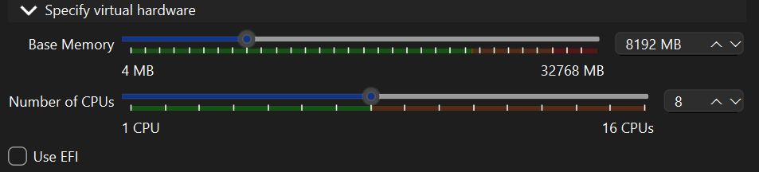

---

## ✅ 2. Configuració del disc dur

La màquina virtual ha de disposar de **dos discos virtuals**.

### Disc principal

- Tipus: **VDI**
- Mida: **32 GB**
- Disc on s’instal·larà el sistema operatiu

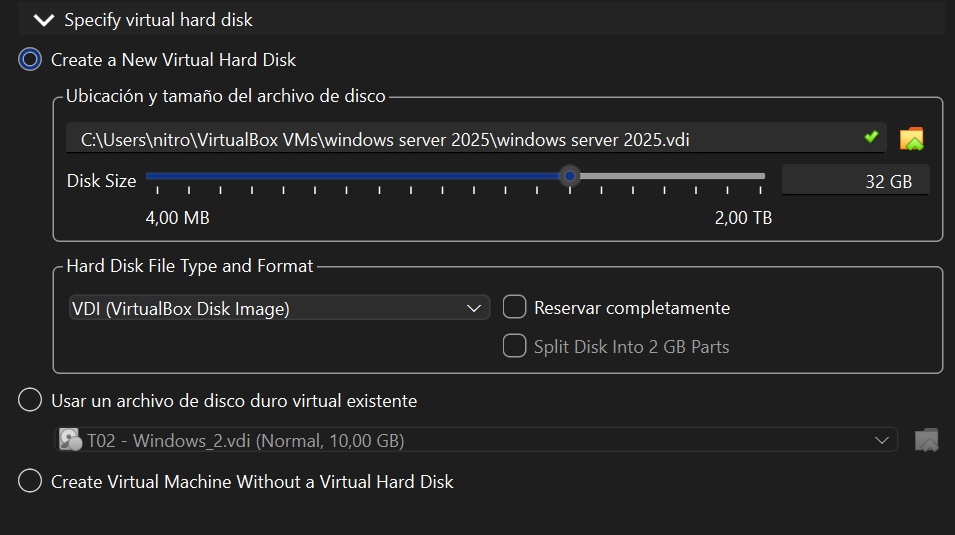

---

### Disc secundari

Després de crear la VM, s’afegeix un segon disc des de:

`Configuració → Emmagatzematge`

- Mida: **10 GB**

---

## ✅ 3. Configuració de xarxa

La VM ha de tenir **dues interfícies de xarxa**.

---

### Adaptador 1: NAT

Configuració:

- Connectar a: **NAT**

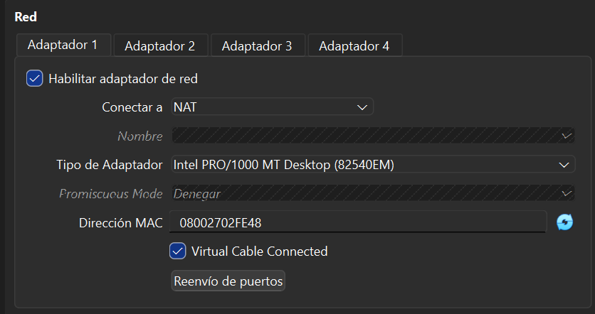

---

### Adaptador 2: Host-Only

Configuració:

- Connectar a: **Adaptador només amfitrió**
- Nom: VirtualBox Host-Only Ethernet Adapter

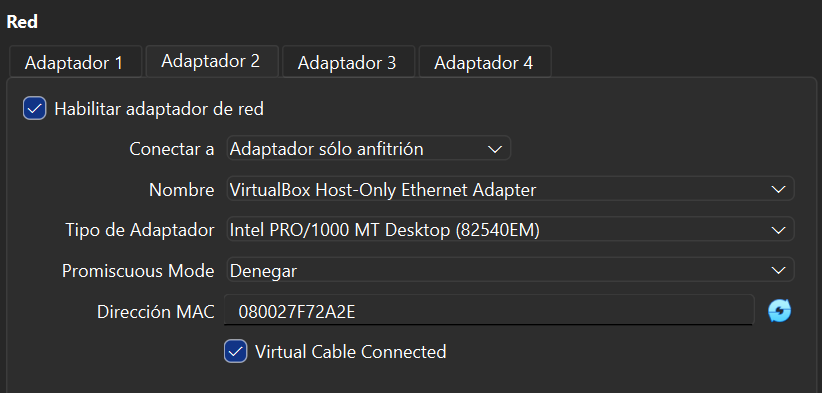

---

## ✅ 4. Instal·lació de Windows Server 2025

S’inicia la VM amb l’ISO de Windows Server 2025.

---

### Selecció d’idioma

Configuració requerida:

- Idioma del sistema: **English (United States)**
- Format regional: **Spanish**
- Teclat: **Spanish**

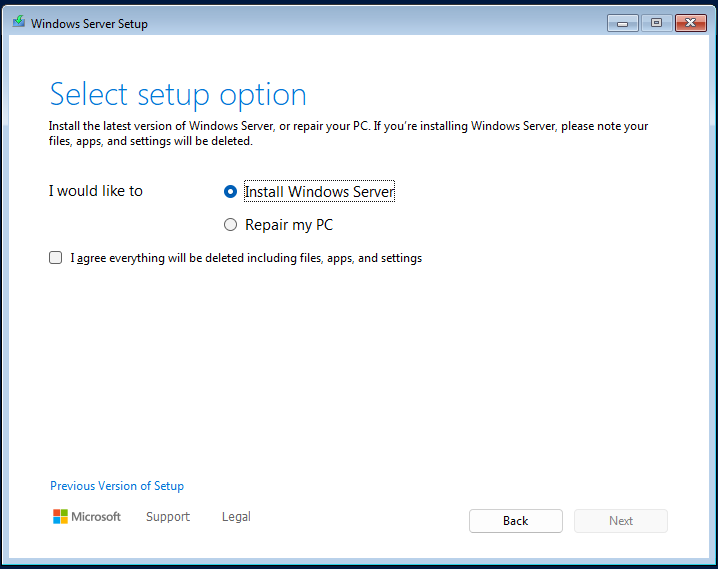

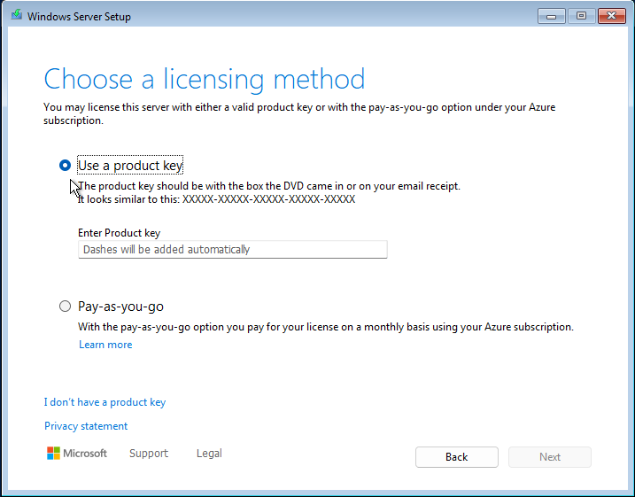

---

### Opció d’instal·lació

Seleccionem:

✅ Install Windows Server

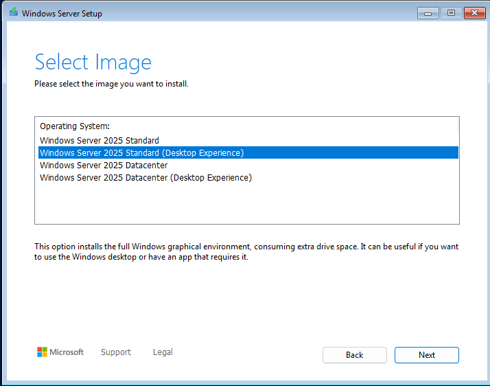

---

### Llicència

En cas de no disposar de clau:

- Seleccionar **I don’t have a product key**

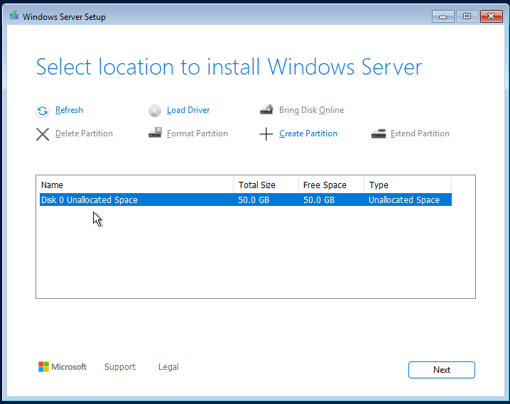

---

### Selecció d’edició amb interfície gràfica (GUI)

Instal·lem:

✅ Windows Server 2025 Standard (Desktop Experience)

---

### Selecció del disc d’instal·lació

Seleccionem:

- Disk 0 Unallocated Space

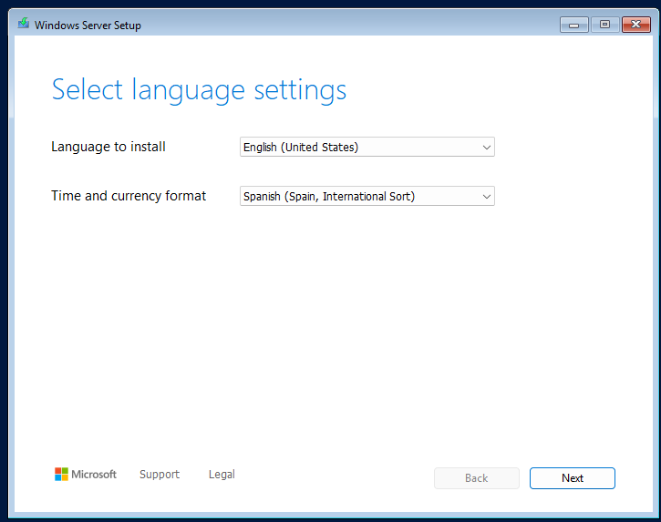

---

## ✅ 5. Canvi del nom de l’equip

Un cop instal·lat, cal canviar el nom del servidor a:

📌 **DCxx** (xx = número de llista)

---

### Des de About → Rename this PC

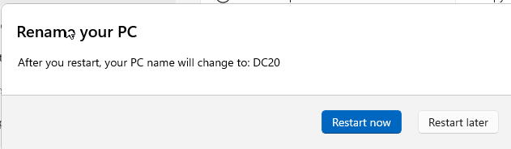

---

### Introduir el nou nom

Exemple: **DC20**

---

### Confirmació del reinici

El canvi s’aplicarà després de reiniciar.

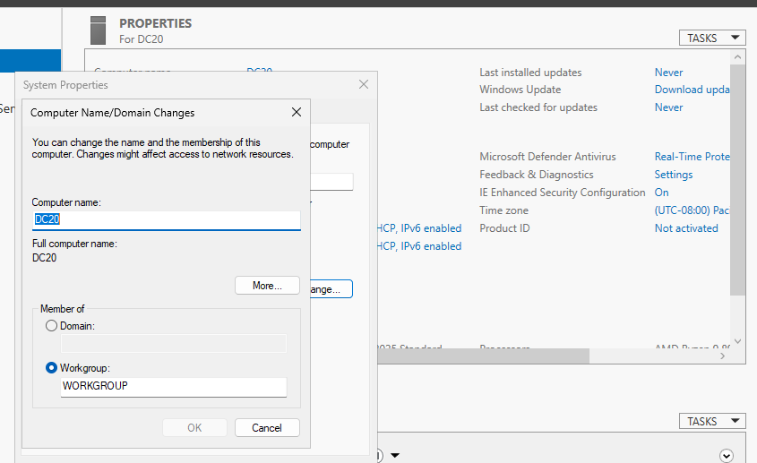

---

### Verificació a Propietats del sistema

---

## ✅ 6. Actualització del sistema

Després de la instal·lació cal executar Windows Update.

---

### Descarregar i instal·lar actualitzacions

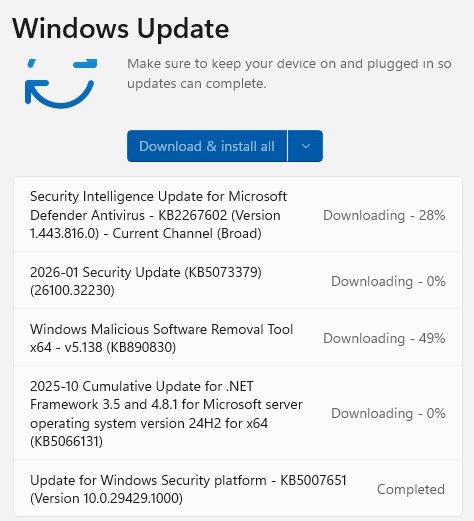

---

### Pausar les actualitzacions el màxim temps possible

Un cop finalitzades:

- Anar a Windows Update
- Seleccionar **Pause updates**

---

# ✅ Procediment completat

La màquina virtual queda configurada amb:

- 8 GB RAM  
- 2 CPUs  
- Disc principal 32 GB + disc secundari 10 GB  
- Xarxa NAT + Host-only  
- Windows Server 2025 GUI en anglès amb teclat espanyol  
- Nom canviat a DCxx  
- Sistema actualitzat i actualitzacions pausades  

---
