# 🏢 T05: Instal·lació del domini (Active Directory)

## 📌 Breu descripció

Com a continuació de la tasca anterior, s’ha de desplegar el **Directori Actiu (Active Directory Domain Services)** sobre la màquina virtual Windows Server 2025 amb l’objectiu de practicar el desplegament que posteriorment es realitzarà en el client real.

Aquest procediment servirà com a **prova de concepte (PoC)** per mostrar als responsables de *TransLògic* i ajustar les configuracions a les necessitats del client.

---

# ✅ Procediment a documentar

## ✅ 1. Instal·lació dels rols necessaris

Ara cal instal·lar el rol de **Active Directory Domain Services**.

Des del *Server Manager* seleccionem:

- **Add roles and features**

---

### Tipus d’instal·lació

Seleccionem:

✅ Role-based or feature-based installation

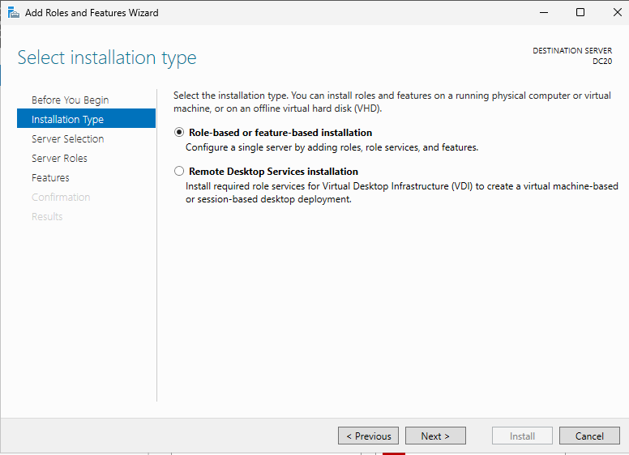

---

### Selecció del servidor

Escollim el servidor:

- **DC20**

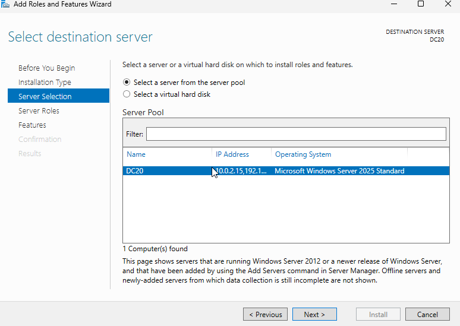

---

### Selecció del rol AD DS

Marquem:

✅ Active Directory Domain Services

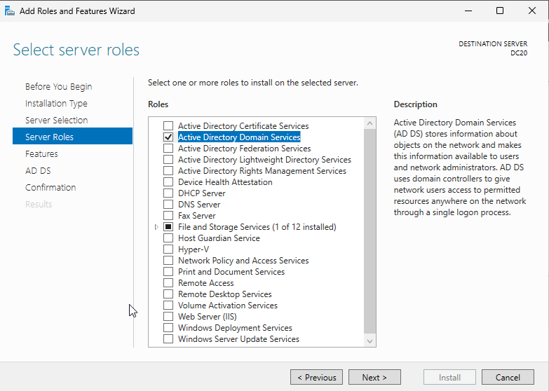

---

### Instal·lació del rol

Esperem que el procés finalitzi correctament.

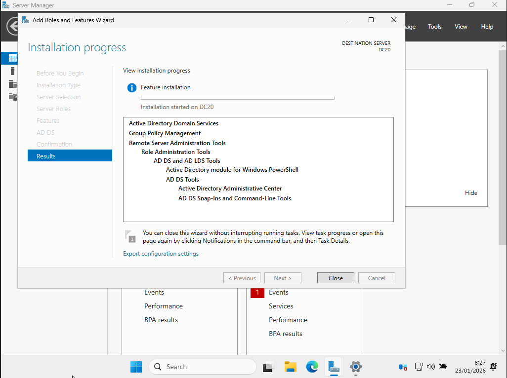

---

## ✅ 2. Configuració DNS abans de promocionar

És recomanable configurar el DNS preferit com:

- **127.0.0.1** (DNS local) per que apunti asi mateix

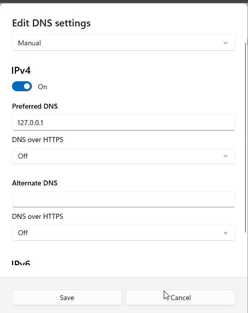

---

## ✅ 3. Promocionar el servidor com a Controlador de Domini

Quan el rol està instal·lat, iniciem el **Configuration Wizard**.

---

## ✅ 4. Crear un domini nou en un bosc nou

A la pantalla *Deployment Configuration* seleccionem:

✅ Add a new forest

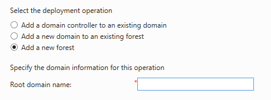

I escrivim el domini:

📌 `translogicXX.test`

Exemple:

`translogic20.test`

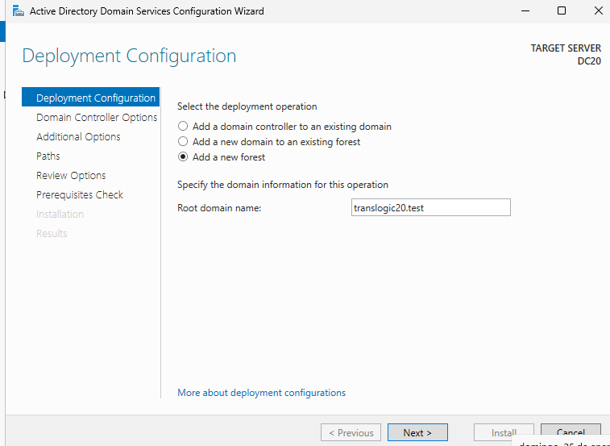

---

## ✅ 5. Opcions del controlador de domini

Configurem:

- Forest functional level: **Windows Server 2025**
- Domain functional level: **Windows Server 2025**
- Marquem DNS i Global Catalog

També introduïm la contrasenya DSRM.

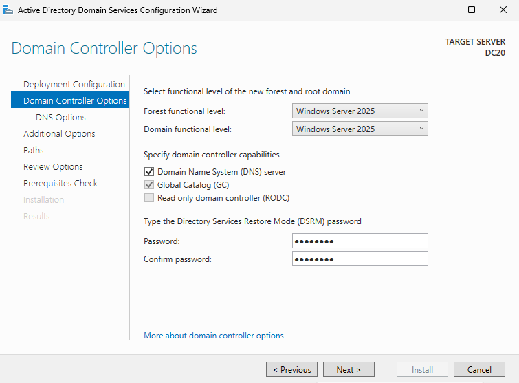

---

## ✅ 6. DNS Options

Apareixerà un avís de delegació DNS, és normal.

Simplement continuem amb **Next**.

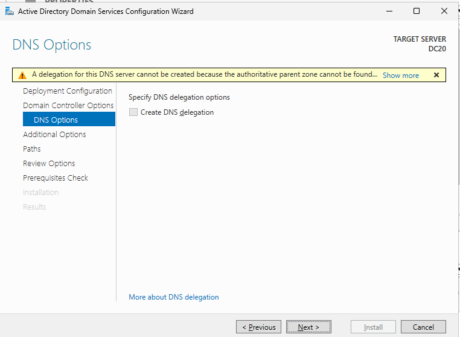

---

## ✅ 7. Additional Options (NetBIOS)

El sistema assigna automàticament el nom NetBIOS:

Exemple:

`TRANSLOGIC20`

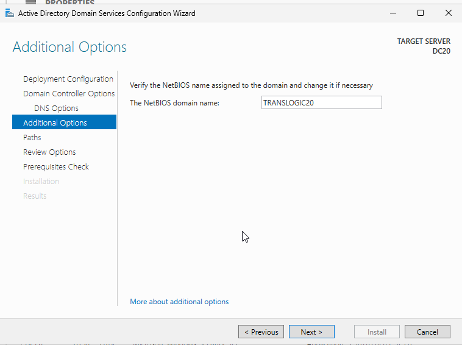

---

## ✅ 8. Pantalla resum (IMPORTANT)

A la pantalla **Review Options** es mostra el resum complet.

⚠️ Aquesta pantalla és important documentar-la.

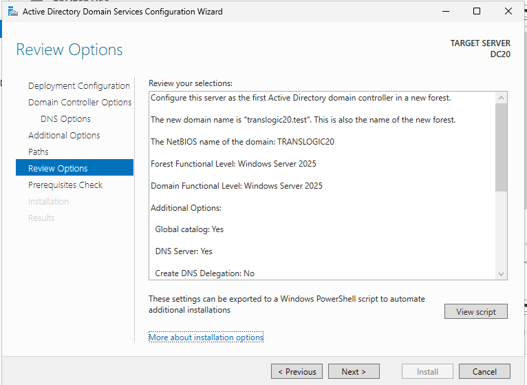

---

## ✅ 9. Generació de l’script PowerShell

En aquesta mateixa pantalla podem copiar l’script automàtic generat per PowerShell.

Aquest script permet automatitzar el desplegament del domini.

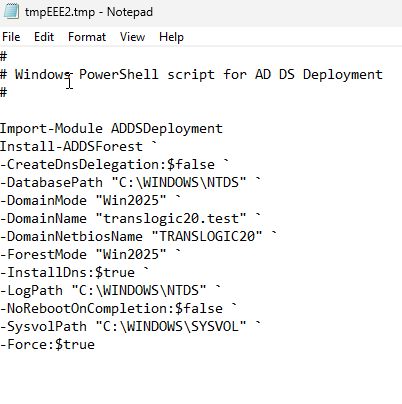

L'enviem per algun correu nostre per tenir-lo guardat

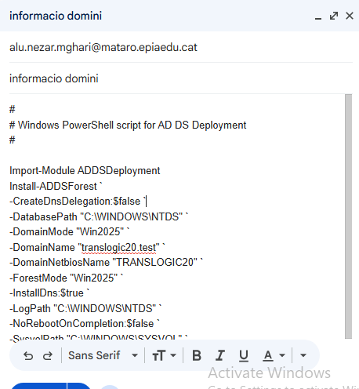

---

## ✅ 10. Finalització i reinici

Després de la instal·lació, el servidor es reiniciarà.

A partir d’aquest moment, l’inici de sessió apareix així:

- **TRANSLOGIC20\Administrator**

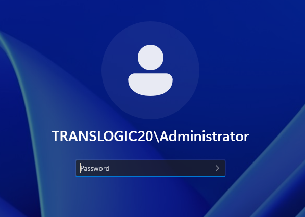

---

## ✅ 11. Verificació del domini

Un cop dins, comprovem que el domini està actiu al Server Manager.

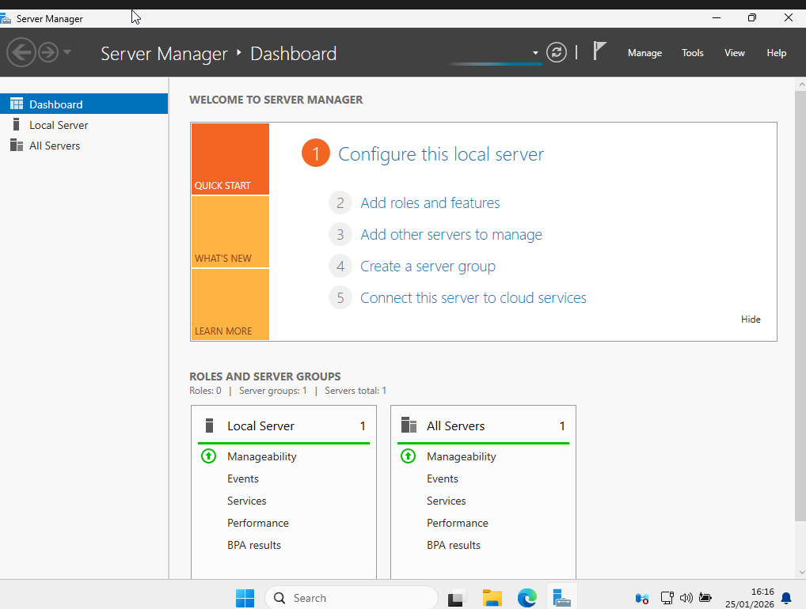

---

## ✅ 12. Comprovació del domini i objectes

Ara per evitar problemas sincronizem l'hora 

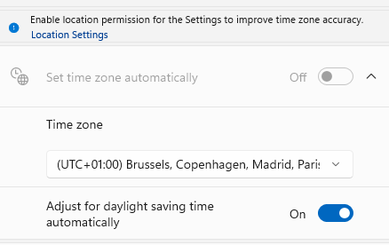

---

## ✅ 13. Gestió DNS i Forwarders

Des del menú Tools:

- DNS Manager

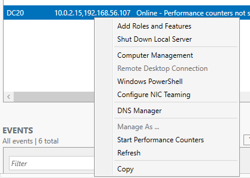

---

### Forwarders configurats

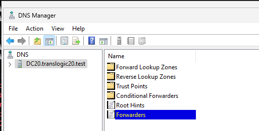

Afegim DNS externs com:

- 8.8.8.8 (Google)

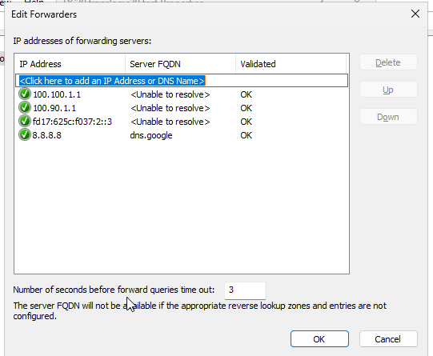

---

# 📚 Materials i suport

- Guia **UD6.AA3 Instal·lació DC** (Moodle SOX)

---

# ✅ Tasca completada

El servidor ha estat promocionat correctament com a **Controlador de Domini**, amb:

- Domini: `translogicXX.test`
- Bosc nou creat
- Nivell funcional: Windows Server 2025
- DNS instal·lat
- Script PowerShell generat i guardat

I ja estaria 👍

---
