# 🧩 T06: Configuració del domini

## 📌 Breu descripció
Un cop tenim ja el domini creat, el següent pas és **desplegar-lo**, és a dir, crear els diferents objectes que el formaran: **grups, usuaris i equips**. En aquesta pràctica es veu la utilitat d’organitzar els objectes amb **unitats organitzatives (OU)**.

## 🧾 Introducció
L’objectiu és preparar l’estructura bàsica del domini **translogicXX.test** (en el nostre cas `translogic20.test`) amb:
- OU per organitzar objectes
- Grups amb jerarquia
- Plantilles d’usuari (templates) amb grup i carpeta personal
- Usuaris de prova basats en les plantilles
- Un equip client **PC1** (en captures surt com `PC-1`) unit al domini
- Validació iniciant sessió amb els usuaris de prova

---

# ✅ Procediment pràctic

## 1) Crear l’estructura d’Unitats Organitzatives (OU)
Obrim **Active Directory Users and Computers** i verifiquem el domini.

Creem les OU necessàries (exemple d’estructura):
- `usuaris`
- `grups`

Creació de la OU **grups**:

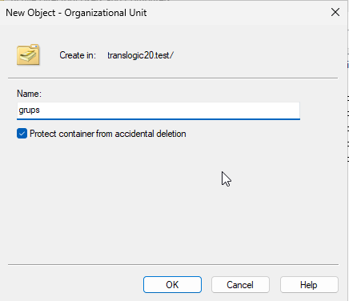

I aixi amb l¡altre

---

## 2) Definir l’estructura de grups
Dins la OU `grups`, creem els grups:
- `gestio`
- `magatzem`
- `gerencia`
- `personal`

Exemple creant el grup **gestio**:

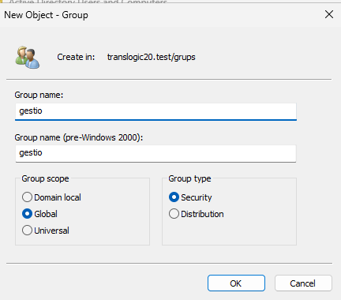

Comprovació dels grups creats:

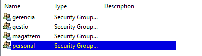

Afegim **gestio**, **magatzem** i **gerencia** com a membres de **personal**:

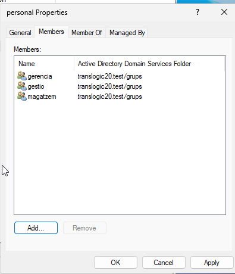

---

## 3) Crear la carpeta compartida per a carpetes personals (homes)
Creem la carpeta (en el nostre cas al disc `F:`):
- `F:\homes`

La compartim perquè quedi com:
- `\\DC20\homes`

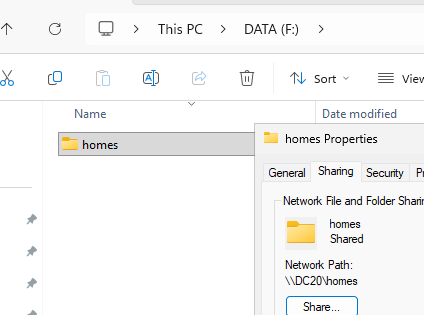

Anem a Advanced Security Settings i creem o editem 'Domain Users'

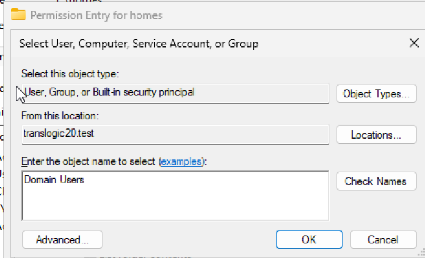

Un cop creat editem els seus permisos i clickem en "Show advancet permisions" en el nostre cas **nomes** li posem els seguents permisos

**Type: Allow**
**Aplies to: This folder only**

**Advanced permissions:**

**List Folder/Read Data**
**Traverse folder/Excectute**
**Read attributes**
**Read extended attributes**
**Read permissions**

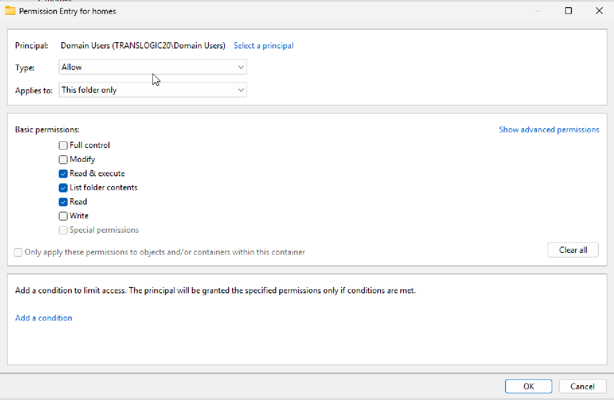

I mirem si s'ha aplicat anant a "Effective Acces"

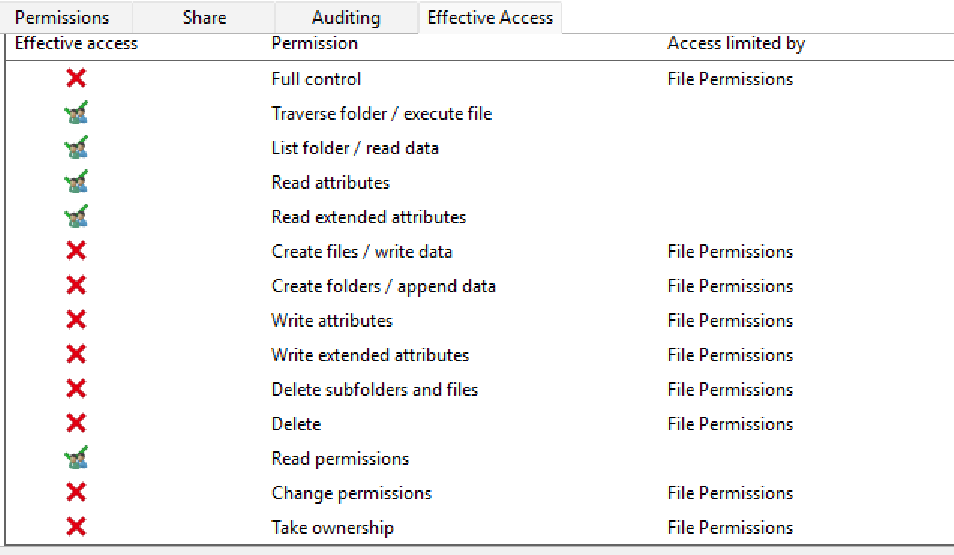

---

## 4) Crear plantilles d’usuari (templates)
Creem una plantilla per cada grup:
- `Gestio`
- `Magatzem`
- `Gerencia`

Exemple creant la plantilla **Gestio** (usuari de tipus plantilla, habitualment deshabilitat):

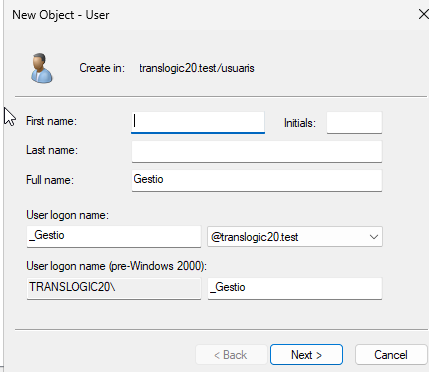

Contrasenya i deshabilitar el compte (plantilla):

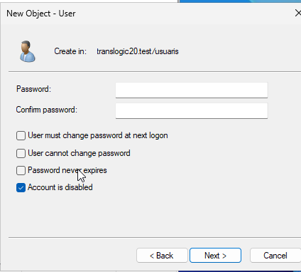

Afegim la plantilla al seu grup (exemple: `gestio`):

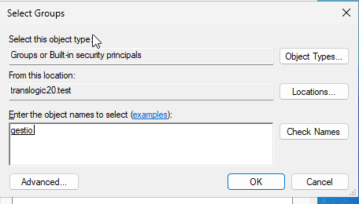

Configurem la **carpeta personal** (Profile → Home folder).
Exemple mapejant unitat `Z:`:

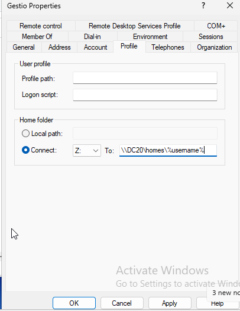

En el nostre cas també es veu una configuració del tipus:

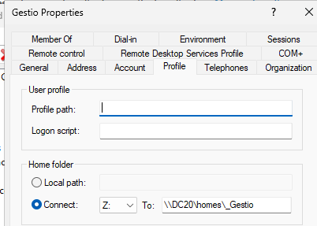

> **Nota important (captura d’error):** si s’intenta posar un UNC a “Local path” pot donar error. Per a rutes de xarxa, cal usar **Connect** i un UNC correcte. (m'ha pasat)

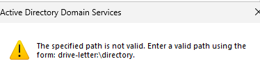

Exemple del problema a la plantilla **Magatzem**:

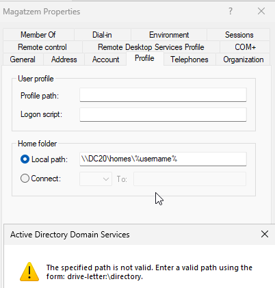

Quan està ben configurat, es creen carpetes dins `homes` (exemple):

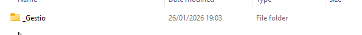

Llista de plantilles creades:

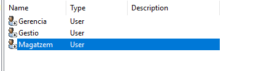

---

## 5) Crear usuaris de prova a partir de les plantilles

> **Nota important:** Mai posis accents, majuscules o caracters especials, pots generar conflictes. 

Per crear usuaris basats en plantilla, fem clic dret sobre la plantilla i **Copy...**

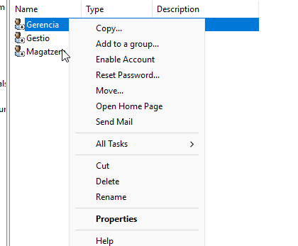

### Usuari de prova (Gerencia)
Exemple: **Victor Rodriguez** (`V.Rodriguez`) copiat des de `Gerencia`

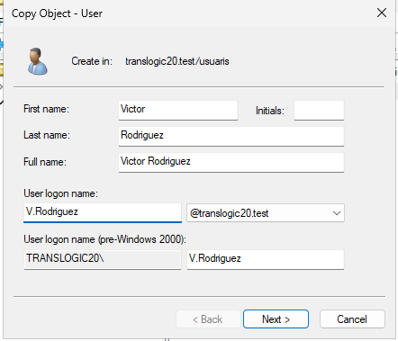

Definim contrasenya (marcant que l’usuari la canviï al primer inici):

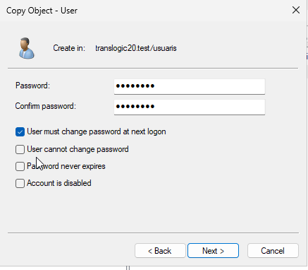

Resum de la còpia (important revisar abans de Finish):

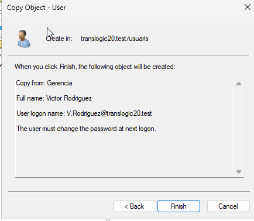

### Usuari de prova (Gestio)
Exemple: **Biel Batalla** (`B.Batalla`) copiat des de `Gestio`

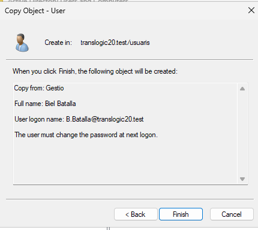

### Usuari de prova (Magatzem)
Exemple: **Nezar Mghari** (`N.Mghari`) copiat des de `Magatzem`

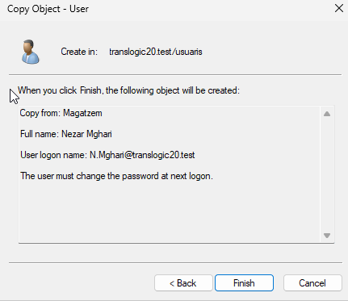

Comprovem que s’han creat les carpetes personals (templates + usuaris):

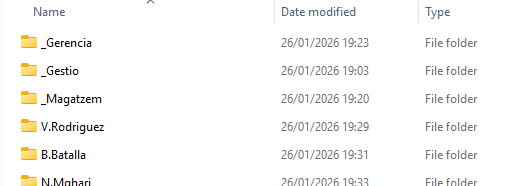

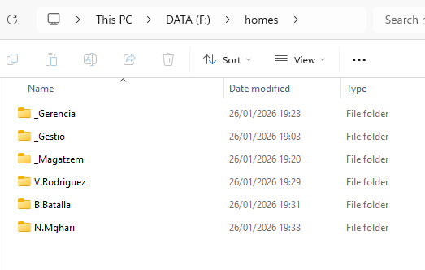

---

## 6) Aprovisionar un equip (PC1) al domini
Creem l’objecte equip dins la OU d’equips (en captures es crea com `PC-1`):

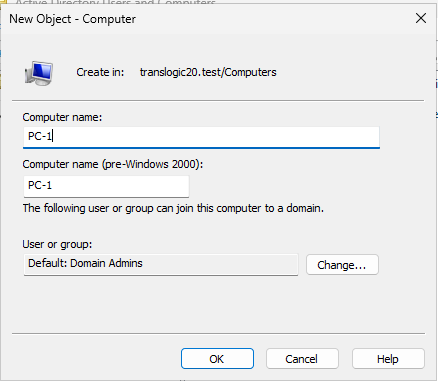

A Server Manager podem veure les IP del DC (útil per configurar el DNS al client):

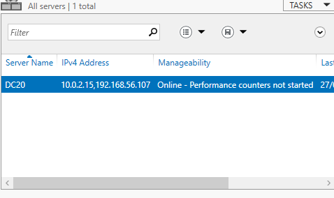

---

## 7) Crear una VM Windows 11 i unir-la al domini
Crear una VM amb:
- Windows 11
- **4 GB RAM**
- Disc suficient
- Xarxa **NAT** (segons enunciat)

> **Important:** per unir-se al domini, el client ha de poder arribar al DC i usar-lo com a DNS. En les captures s’utilitza com a DNS la IP `192.168.56.107` (DC), així que el client ha de tenir connectivitat cap a aquesta xarxa.

Configurem el DNS del client apuntant al DC (exemple: `192.168.56.107`):

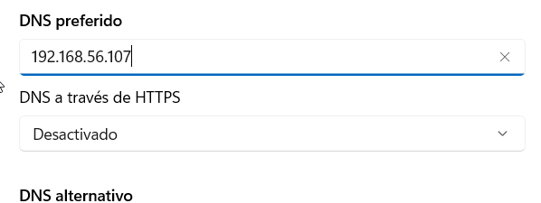

Canviem el nom del PC (objectiu: **PC1**; en captures: `PC-1`):

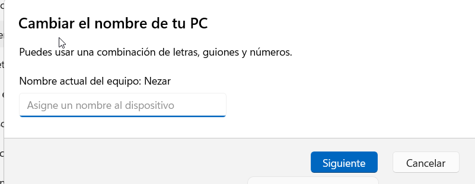

Unim el client al domini `translogic20.test`:

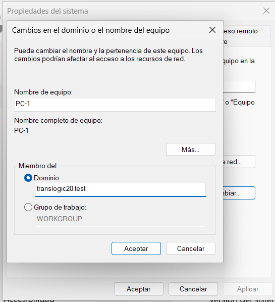

Credencials per unir-se al domini (ex: `Administrator`):

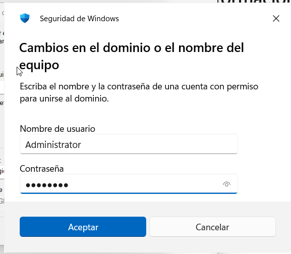

Confirmació d’unió correcta al domini:

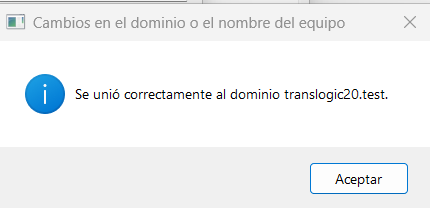

---

## 8) Comprovació: inici de sessió amb usuaris de prova
Iniciem sessió al client amb els usuaris del domini (exemple amb `translogic20\N.Mghari`):

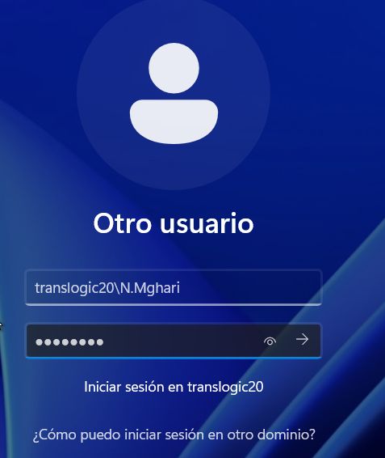

Si s’ha marcat “must change password”, demanarà canvi abans d’entrar:

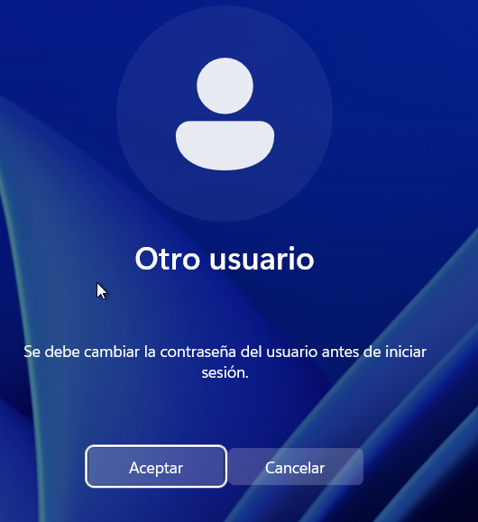

Procés de canvi de contrasenya:

Benvinguda després del primer inici:

Comprovació de la carpeta personal mapejada (unitat `Z:`):

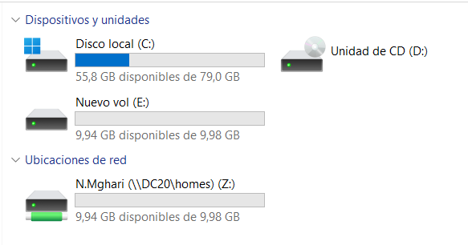

Comprobem si es pot anar amb un altre carpeta intentant obrir la carpeta B.Batalla (estic iniciat actualment a la de N.Mghari)

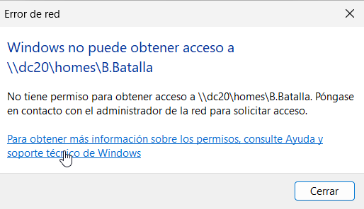

> Repetir la comprovació iniciant sessió amb els altres dos usuaris de prova:
> - `V.Rodriguez`
> - `B.Batalla`
> - `N.Mghari`

I ja estaria 👍
---

# 📚 Materials i links de suport
- **UD6.AA3 Desplegament** (Moodle 0224 SOX)
- [**Tornar al readme**](README.md)
- [**Tornar el projecte**](../README.md)
