# 0226 · RA3: Anàlisi de vulnerabilitats (OpenVAS)

## Breu descripció
En aquesta activitat analitzem les vulnerabilitats d’un sistema informàtic mitjançant una eina d’escaneig de vulnerabilitats (OpenVAS). L’objectiu és identificar punts febles del sistema i proposar mesures per mitigar-los.

## Resultats d’aprenentatge i criteris d’avaluació
- **RA3.** Aplica mecanismes de seguretat activa descrivint-ne les característiques i relacionant-les amb les necessitats d’ús del sistema informàtic.
- **CA3.3.** Realitza actualitzacions periòdiques dels sistemes per corregir possibles vulnerabilitats.

## Entorn de treball
- **Màquina d’anàlisi:** OpenVAS (OVA importada a VirtualBox).
- **Màquina objectiu:** Metasploitable-2 (Linux vulnerable, OVA importada a VirtualBox).

---

## Preparació de l’entorn

### 1) Equip a escanejar (Metasploitable-2)
1. Importa la OVA de **metasploitable-2** a VirtualBox.
2. Configura la xarxa en **xarxa NAT**.
3. Inicia la VM.
4. Credencials per defecte:
   - **Usuari:** `msfadmin`
   - **Contrasenya:** `msfadmin`
5. Obre un terminal i obtén la IP amb `ip a`. En el meu cas, la IP és **10.0.2.4**.

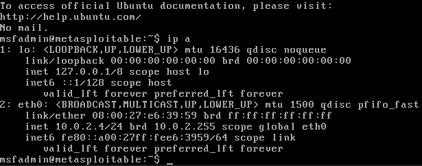

---

### 2) Equip amb OpenVAS
1. Importa la OVA d’**OpenVAS** a VirtualBox.
2. Configura **dues interfícies de xarxa**:
   - **Adaptador 1:** xarxa NAT (Internet + connectivitat amb la màquina objectiu).
   - **Adaptador 2:** host-only (accés a la interfície web des del PC amfitrió).
3. Inicia la VM d’OpenVAS.
4. A la configuració inicial, entra al menú **Setup Menu**.

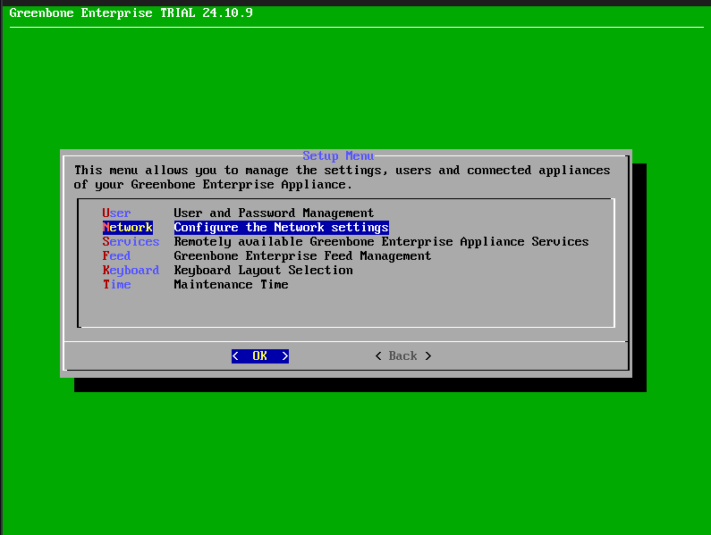

#### 2.1) Configuració de xarxa (DHCP a ambdues interfícies)
1. Entra a **Network**.

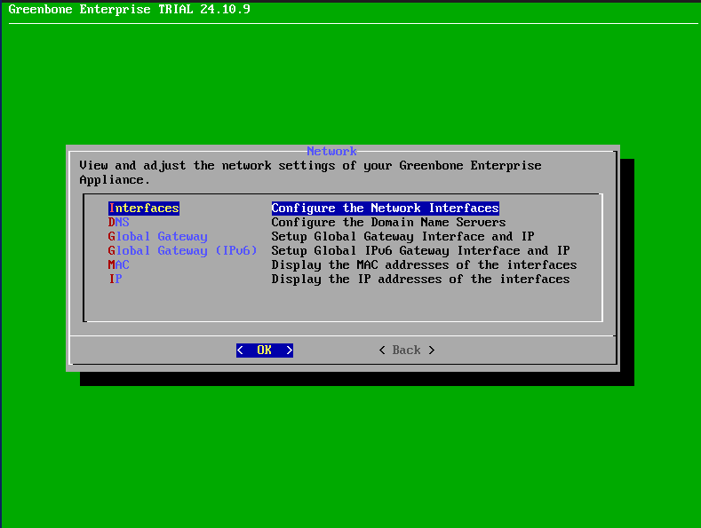

2. Entra a **Interfaces** i configura **eth0** i **eth1**.

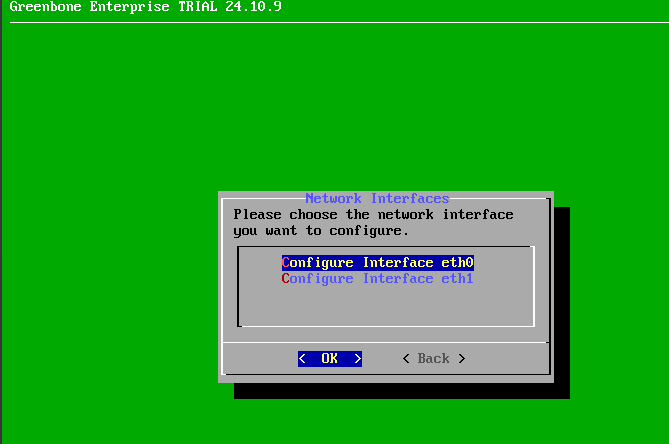

3. A **eth0**, activa **IPv4** i **DHCP**.

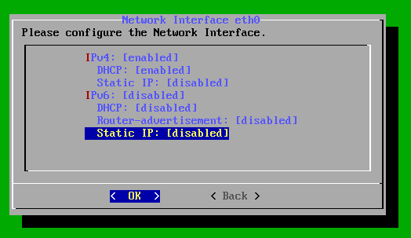

4. A **eth1**, activa **IPv4** i **DHCP** i guarda.

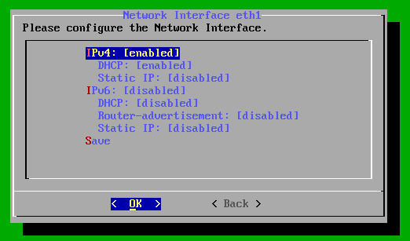

5. Consulta les IPs assignades. En el meu cas:
   - **eth0 (NAT):** `10.0.2.6/24`
   - **eth1 (host-only):** `192.168.56.108/24`

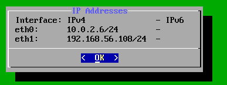

---

## Accés a OpenVAS via web
1. Des del teu PC amfitrió, entra al navegador i accedeix a la IP **host-only** (ex.: `https://192.168.56.108`).
2. És normal que surti un avís del certificat (autofirmat). El pots ignorar.
3. Inicia sessió amb l’usuari creat (en aquest cas `usuari`).

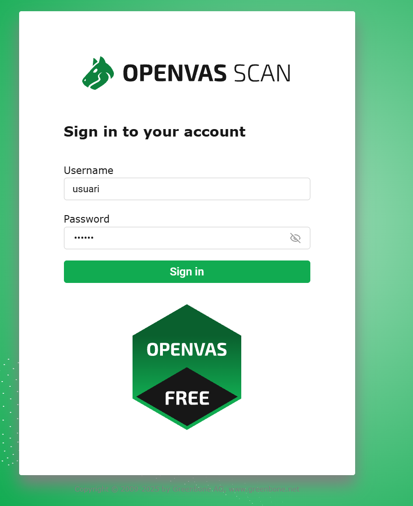

4. Un cop dins, veuràs el panell principal (Dashboards).

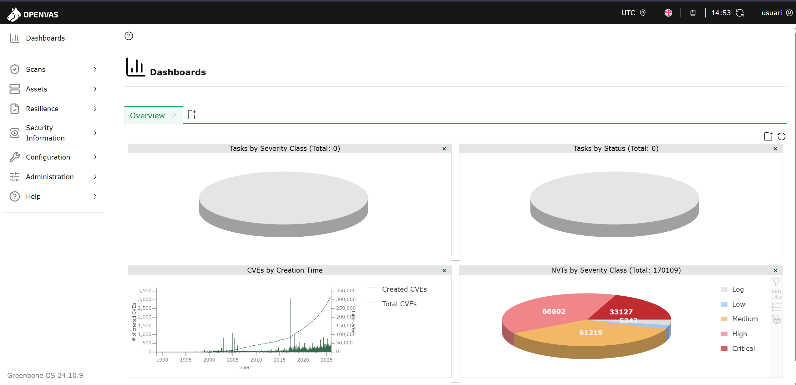

*(Opcional)* Pots crear un dashboard nou.

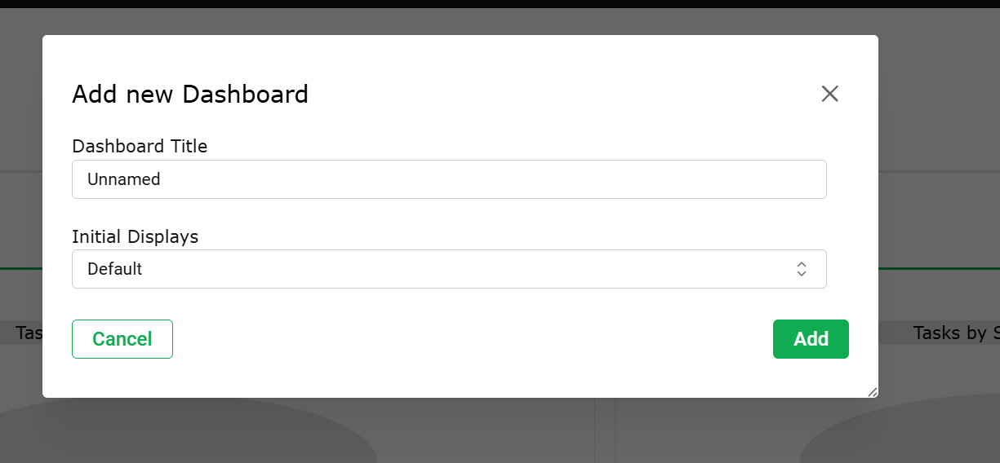

---

## Procediment pràctic: anàlisi de vulnerabilitats

### 1) Crear el Target (objectiu de l’escaneig)
1. Crea un **Target** nou (Scans → Targets → New).
2. Assigna-li un nom (ex.: `msfadmin-ssh`) i selecciona els hosts des de **host assets**.

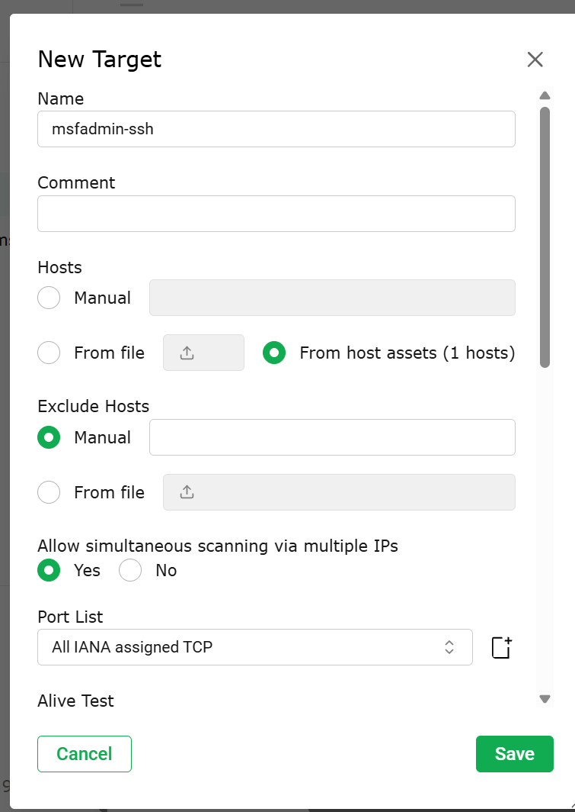

3. A l’apartat **Credentials for authenticated checks**, prepara l’ús de credencials (SSH/SMB). En aquest cas, fem servir **SSH (port 22)**.

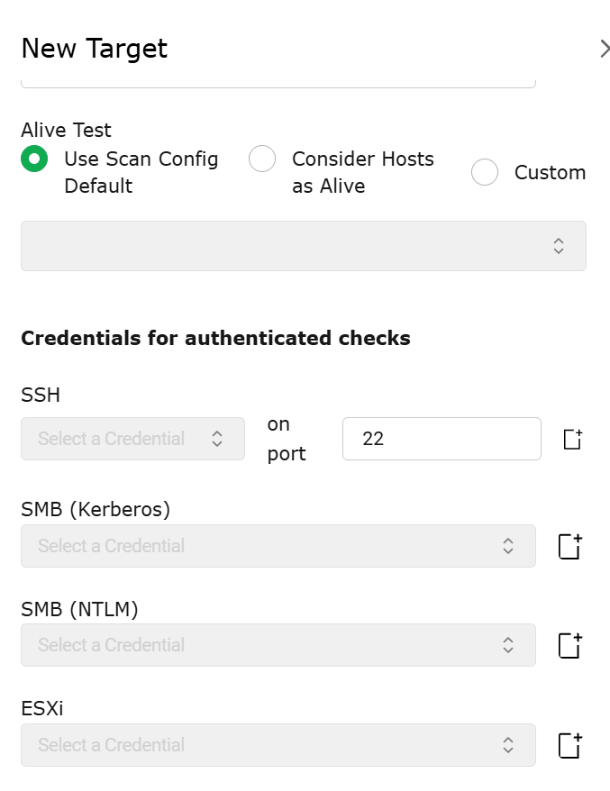

### 2) Crear credencial SSH per checks autenticats
1. Crea una credencial SSH nova:
   - **Name:** `msfadmin-ssh`
   - **Type:** `Username + Password`
   - **Username:** `msfadmin`
   - **Password:** `msfadmin`

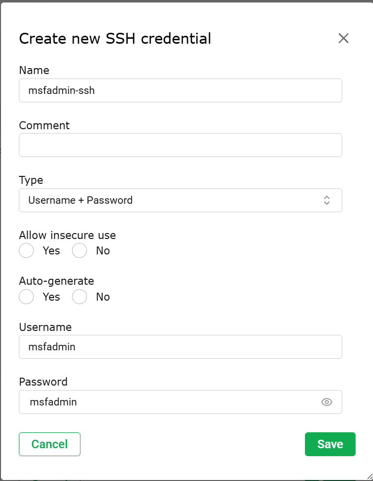

2. Desa la credencial i vincula-la al Target (SSH).

---

### 3) Crear la Task (tasca d’escaneig)
1. Crea una **Task** nova (Scans → Tasks → New).
2. Configura:
   - **Name:** `vulnerable linux`
   - **Scan Targets:** el target creat
   - **Min QoD:** `70`

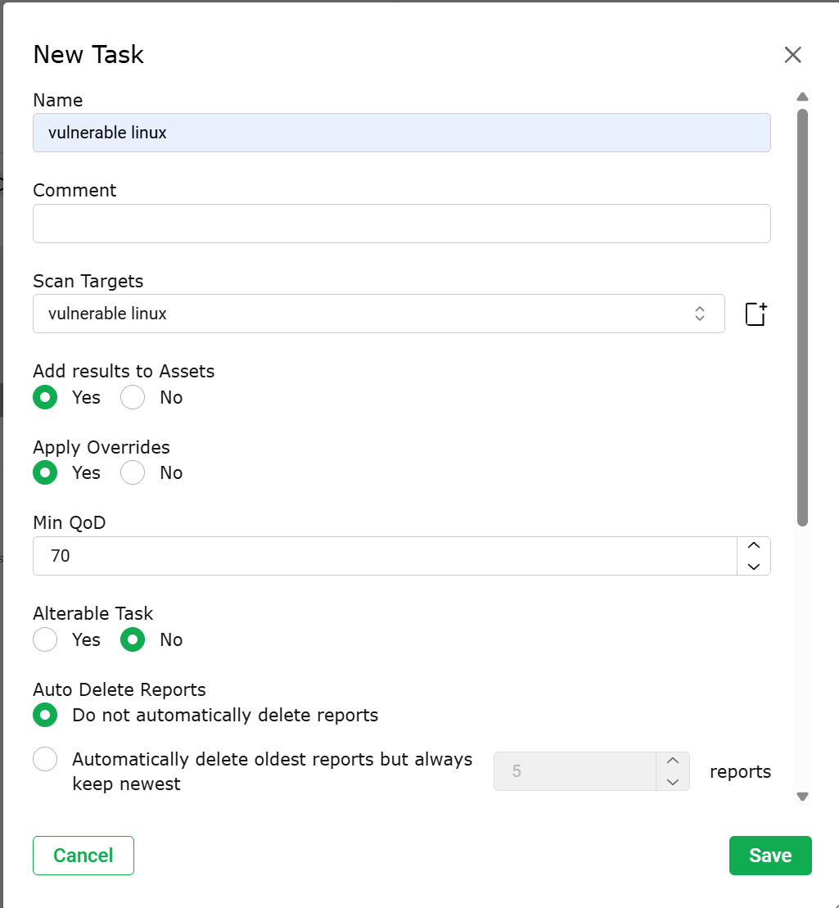

3. Desa la tasca.

---

### 4) Executar l’escaneig
1. Des de Tasks, executa la tasca (`Start`).
2. Es mostrarà l’estat d’execució (progrés).

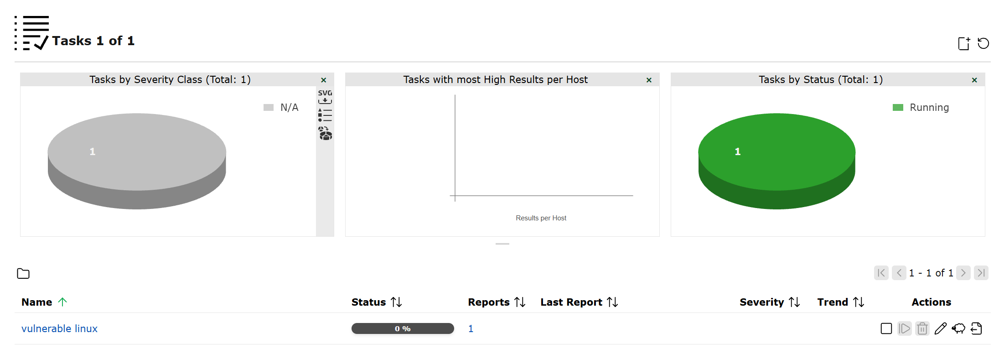

3. Quan finalitzi, l’estat quedarà com a **Done** i podràs obrir el report.

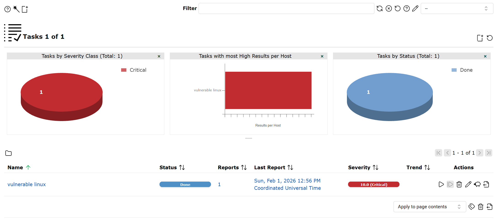

*(Exemple d’estat en progrés)*

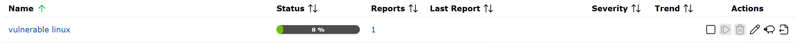

---

## Recollida de resultats (Reports)
1. Dins del report, a la pestanya **Information** tens el resum:
   - Nom de la task
   - Temps d’escaneig i durada
   - Host escanejat
   - Filtres (min_qod=70)

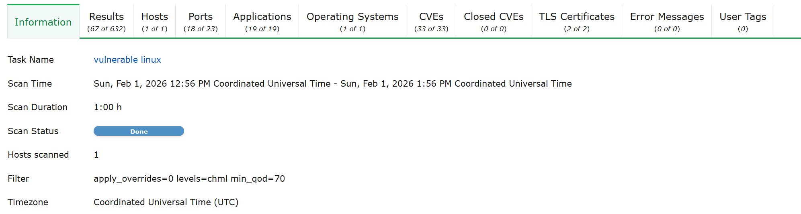

2. A **Results** veuràs el llistat de troballes detectades (ordenables per severitat).

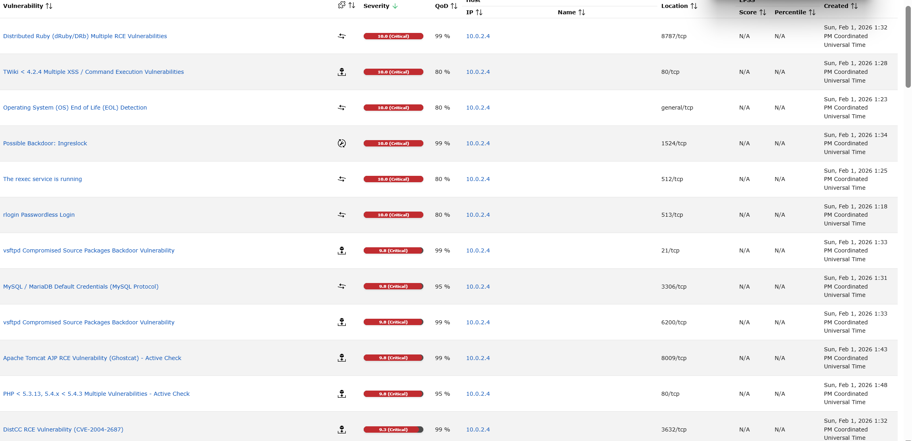

3. A **Ports** pots veure quins ports exposats estan associats a severitats altes.

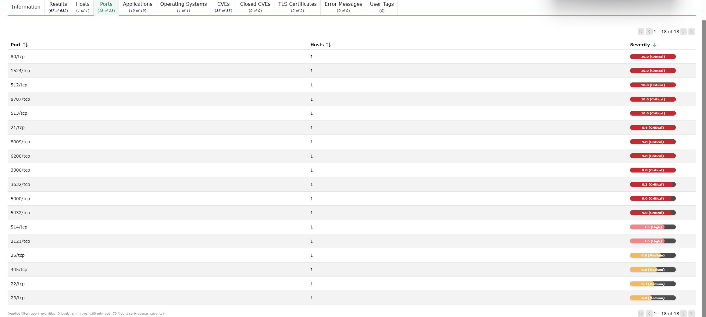

4. A **Applications** es mostren aplicacions/serveis detectats i la seva severitat.

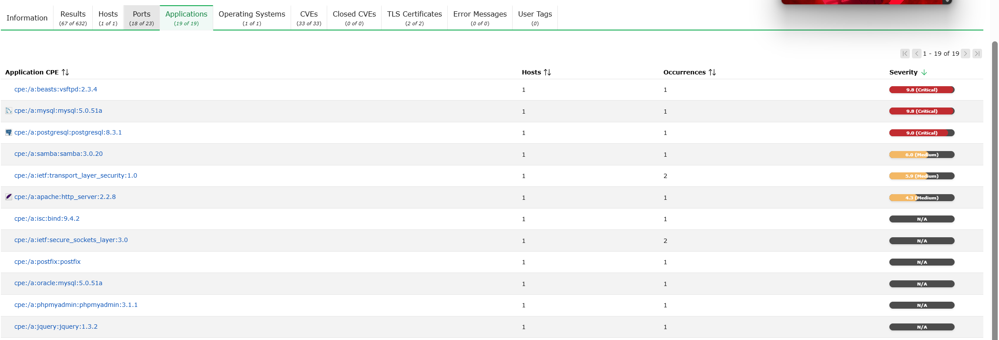

5. A **Operating Systems** identifica el sistema detectat (en aquest cas **Ubuntu 8.04**).

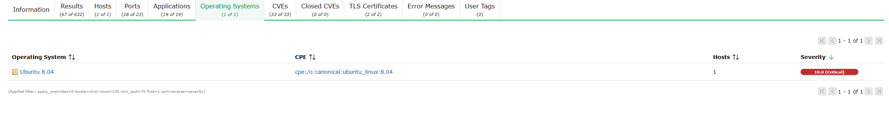

6. A **CVEs** tens el llistat de CVEs associats a les deteccions (molt útil per documentar).

7. També pots obrir el detall d’una vulnerabilitat concreta (ex.: TWiki) per veure explicació i solució.

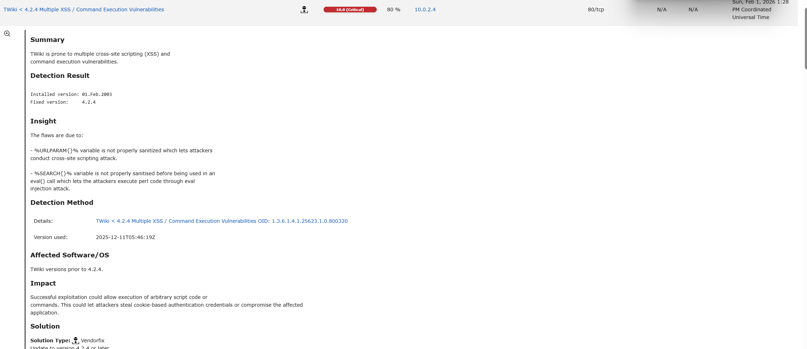

---

## Anàlisi de 4 vulnerabilitats trobades

> **Nota:** la severitat indicada és la que mostra OpenVAS (CVSS).

### 1) TWiki < 4.2.4 Multiple XSS / Command Execution
- **CVE:** `CVE-2008-5304`, `CVE-2008-5305`
- **Severitat:** **10.0 (Critical)**
- **Descripció:** TWiki és vulnerable a XSS i a execució de comandes per variables no sanejades.
- **Possible explotació:** un atacant pot injectar codi (XSS) o arribar a executar codi/ordres al servidor web.
- **Mesures de mitigació:**
  - Actualitzar TWiki a **4.2.4 o superior**.
  - Restringir l’accés al servei (firewall / només LAN / reverse proxy).
  - Revisar permisos i deshabilitar components no necessaris.

*(Referències visuals: CVEs i detall)*  
  

---

### 2) vsftpd Compromised Source Packages Backdoor
- **CVE:** `CVE-2011-2523`
- **Severitat:** **9.8 (Critical)**
- **Descripció:** versions compromeses de vsftpd incorporaven una porta del darrere.
- **Possible explotació:** accés remot no autoritzat (backdoor) mitjançant el servei FTP.
- **Mesures de mitigació:**
  - Actualitzar vsftpd a una versió segura i verificar l’origen dels paquets.
  - Si no cal FTP, **deshabilitar el servei**.
  - Filtrar el port 21/tcp i limitar accessos (ACL/firewall).

*(Referències visuals: aplicació detectada i CVE)*  
  

---

### 3) Apache Tomcat AJP RCE (Ghostcat)
- **CVE:** `CVE-2020-1938`
- **Severitat:** **9.8 (Critical)**
- **Descripció:** vulnerabilitat del connector AJP que pot permetre lectura de fitxers i, en certs escenaris, execució remota.
- **Possible explotació:** lectura de configuracions sensibles / fitxers de l’aplicació i pivotar a compromís.
- **Mesures de mitigació:**
  - Actualitzar Tomcat a versions corregides.
  - **Deshabilitar AJP** si no és necessari o restringir-lo a localhost.
  - Filtrar el port AJP (habitualment 8009/tcp).

*(Referència visual: CVE al llistat)*  

---

### 4) DistCC RCE Vulnerability
- **CVE:** `CVE-2004-2687`
- **Severitat:** **9.3 (Critical)**
- **Descripció:** el servei distccd pot permetre execució remota de comandes si està exposat.
- **Possible explotació:** un atacant podria executar comandes arbitràries al sistema objectiu.
- **Mesures de mitigació:**
  - Deshabilitar distccd si no s’utilitza.
  - Restringir per firewall (només IPs de confiança).
  - Actualitzar i revisar configuració del servei.

*(Referència visual: CVE al llistat)*  

I ja estaria 👍

---

## Conclusions i bones pràctiques
- L’escaneig ha detectat múltiples serveis vulnerables exposats a la xarxa.
- Cal aplicar **actualitzacions periòdiques**, retirar serveis no necessaris i segmentar la xarxa.

## Materials i links de suport
- **UD6.AA3 Desplegament** [Moodle 0224 SOX]
- Vídeos de suport:
  - `OpenVAS-configurar.mp4`
  - `OpenVAS-scan.mp4`
  - `OpenVAS-resultats.mp4`
    
---

- [**Tornar al readme**](README.md)
- [**Tornar el projecte**](../README.md)
